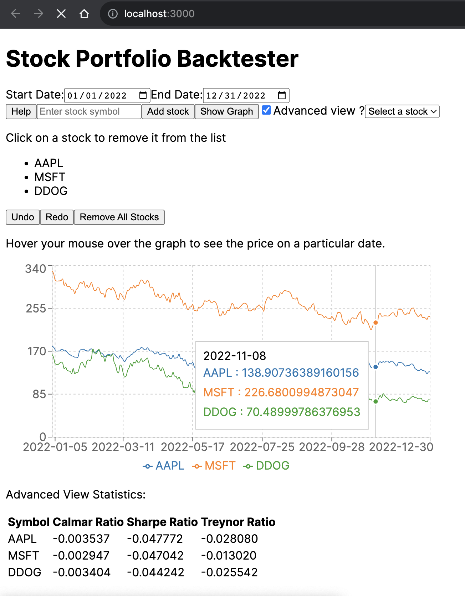
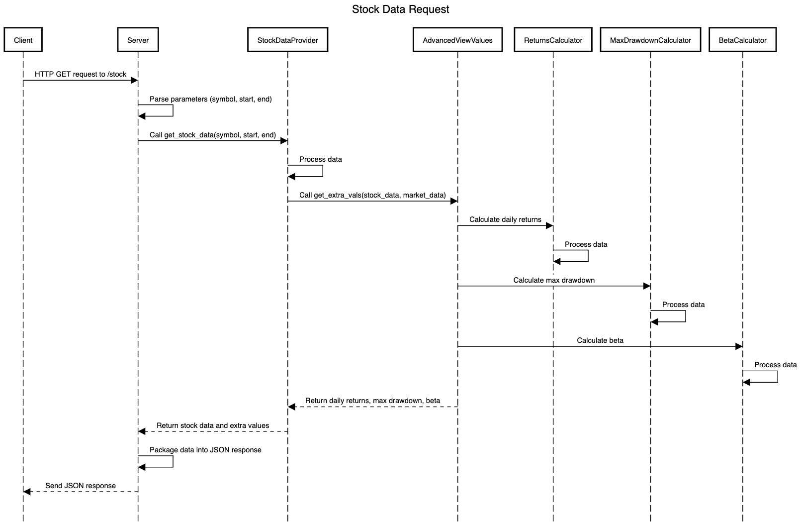
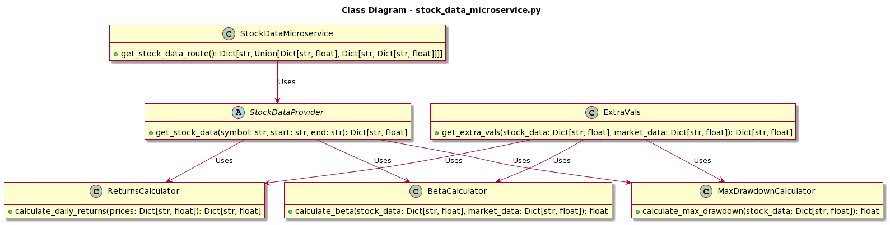
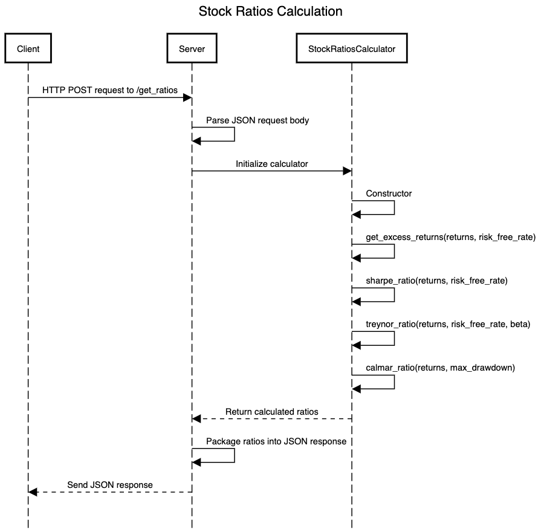
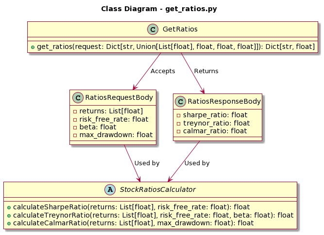

# Stock Portfolio Backtester

Welcome to the Stock Portfolio Backtester! This web application empowers you to analyze and visualize stock data, compute essential financial ratios, and gain valuable insights into your stock portfolio's performance. It represents the culmination of my dedication during my final project in Oregon State University's CS361 (Software Engineering 1) class.

Throughout this collaborative project, students formed pairs to work together. Each partnership was tasked with the development of a main project (which you're currently exploring) and a custom-tailored microservice designed to meet the specific needs of their partner's project. Detailed information about the microservice created by my partner, which complements this main project, can be found later in the readme.

## Application Overview

This application consists of several components that work together to provide stock data analysis and advanced statistics. Below, you'll find an overview of the application's structure and interactions.

### User Interface

The user interface allows you to input stock symbols, select date ranges, and trigger data analysis. It also provides options to toggle advanced statistics and access developer tools in DevMode.



### Frontend

The Frontend of the Stock Portfolio Backtester is responsible for displaying the user interface and interacting with the data services. To run the Frontend, follow these steps:

1. Navigate to the frontend directory in your project.
2. Install the necessary dependencies by running:

   ```bash
   npm install
   ```

3. Build the frontend
   ```bash
   npm run build
   ```

4. Start the development server by running:

   ```bash
   npm run start
   ```

The Frontend will be accessible in your browser at `http://localhost:3002`.

### Stock Data Microservice

The Stock Data Microservice retrieves stock data for the selected stocks and date range. It communicates with external sources to fetch stock prices and related information. Make sure to run this service on localhost:8000.

To run the Stock Data Microservice, open a terminal, navigate to the appropriate directory, and execute the following commands:

```bash
pip install -r requirements.txt
python stock_data_microservice.py
```
**UML Sequence Diagram:**



**UML Class Diagram:**



### Ratios Calculation Service (Created by my partner, Ryan)

The Ratios Calculation Service, created by my partner in the software engineering class, calculates key financial ratios, including Sharpe Ratio, Treynor Ratio, and Calmar Ratio, based on the stock data and user input. It provides a REST API for these calculations and runs on localhost:5001.

To run the Ratios Calculation Service, open another terminal, navigate to the appropriate directory, and execute the following command:

```bash
python get_ratios.py
```
**UML Sequence Diagram:**



**UML Class Diagram:**




### To assist my partner in developing their microservice, I provided the following information:

**Microservice Description:**
Stock ratios REST API that will return sharpe ratio, treynor ratio, and calmar ratio, given returns, risk_free_rate, beta, and max_drawdown.

**Communication Method:**
REST API.

**How Others Should Request Data:**
HTTP POST request to microservice URL with data sent to the `/get_ratios` route. The data should include `returns`, `risk_free_rate`, `beta`, and `max_drawdown` passed in the request body.

**Formal API Specification:**
- **POST /get_ratios**
  - Content-Type: application/json
  - Request Body:
    ```json
    { 
      "returns": [number],
      "risk_free_rate": number,
      "beta": number,
      "max_drawdown": number
    }
    ```
  - Response Body:
    ```json
    {
      "sharpe_ratio": number,
      "treynor_ratio": number,
      "calmar_ratio": number
    }
    ```

**Example Curl Request:**
You can copy and paste this command into your terminal when the microservice is running to test it:
```bash
curl --location --request POST 'http://localhost:5000/get_ratios' \
--header 'Content-Type: application/json' \
--data-raw '{
    "returns": [0.01, 0.02, -0.01, 0.03, -0.02],
    "risk_free_rate": 0.001,
    "beta": 1.2,
    "max_drawdown": 0.2
}'
```

**Response Example:**
```json
{
    "calmar_ratio": 0.03,
    "sharpe_ratio": 0.241121411085206,
    "treynor_ratio": 0.004166666666666667
}
```

**Ratio Formulas:**
- Excess returns are calculated by subtracting the risk-free rate from the returns. For example, if the risk-free rate is 0.02 and the returns are `[0.12, 0.07, 0.13, 0.14]`, the excess returns would be `[0.10, 0.05, 0.11, 0.12]`, obtained by subtracting 0.02 from each individual value in returns.
- Sharpe ratio: Mean of the excess returns divided by the standard deviation of the excess returns.
- Treynor ratio: Mean of the excess returns divided by beta.
- Calmar ratio: Mean of the normal returns (not excess returns) divided by the absolute value of the max drawdown.

**Data Format:**
JSON


